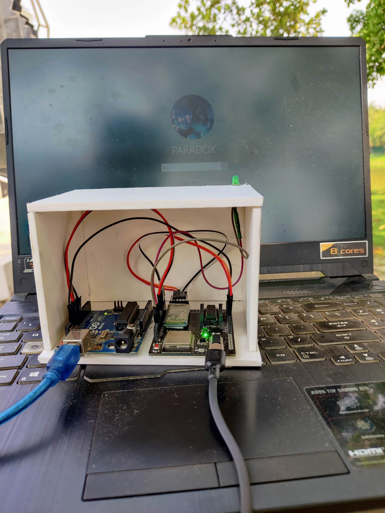

**Description:**\
This project enables users to remotely power on and unlock a PC using an Android application, offering convenient control without needing physical access. Our goal was to create a solution that maintains connectivity with a remote PC even if it unexpectedly powers off or restarts, ensuring seamless remote access in any situation. The app allows users to turn on the PC, automatically enter a preset password to unlock it, and manage basic controls reliably from anywhere.

#### Device: 

#### Features:

-   **Remote Power-On:** Start up the PC remotely using the Android app.
-   **Automated Login:** Unlock the PC by automatically entering a preset password.
-   **Seamless Connectivity:** Connects smoothly to the PC, allowing for quick and reliable remote control.

#### Tech Stack:

-   **Language:** Kotlin
-   **Framework:** Android Studio, Jetpack Compose

#### Installation

1.  **Clone the Repository:**

    bash

    Copy code

    `git clone https://github.com/aceC0der/Remote-PC-Controller.git`

2.  **Open in Android Studio:**

    -   Launch Android Studio.
    -   Navigate to **File > Open** and select the project folder.
3.  **Configure SDK:**

    -   Make sure the latest Android SDK is installed and configured.
    -   Go to **File > Project Structure > SDK Location** and set the Android SDK directory if needed.
4.  **Build the Project:**

    -   Click **Sync Now** if Gradle prompts you for syncing.
    -   Build the project by going to **Build > Make Project**.
5.  **Run the App:**

    -   Connect an Android device via USB or use an emulator.
    -   Select the device and click **Run > Run 'app'**.
